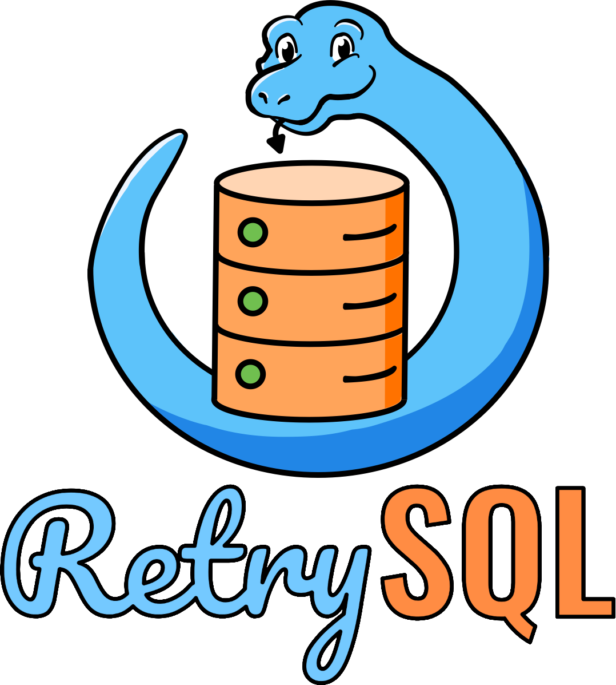

# RetrySQL: text-to-SQL training with retry data for self-correcting query generation

<p align="center">
  
</p>

This repository contains the code, and instructions necessary to reproduce the results presented in our paper: _RetrySQL: text-to-SQL training with retry data for self-correcting query generation._
The provided resources enable users to replicate the steps involved in preparing reasoning steps, corrupting them to
create retry data, and training models with this data. We include everything
required to train an open-source coding model with retry data, validate the improvements 
in execution accuracy, and understand the effectiveness of our method.

<p align="center">
  <a href="https://opensource.org/licenses/MIT">
    
  </a>
</p>

## Environment installation

[Poetry](https://python-poetry.org/docs/basic-usage/) is used as package manager to set up the environment.

We assume that you have **python 3.11.*** installed on your machine. You can set it up using pyenv
(`pyenv install -s && pyenv global "$(pyenv local)"` in project directory).
1. Create virtual env package `python3 -m venv venv`;
2. Activate the virtual env by running `source venv/bin/activate`;
3. Run the command `make install-env` to install Poetry and pull the dependencies needed for the project.

## Reproducibility

### Datasets

#### 1. Download BIRD data

To download the BIRD dataset, run the following commands:

```bash
make download-bird-train-set
make download-bird-dev-set
````

#### 2. Reasoning step generation

In order to extend the BIRD data with reasoning steps you will need to have access to a GPT-4o subscription. You can configure the access to
LLMs hosted in Azure or Google Cloud Platform (GCP) by editing the `configs/llm_endpoints.yaml` and
specifying endpoint and credentials for your subscription.

To generate reasoning steps for the BIRD dataset, run the following command:

```bash
python -m text2sql.datasets.reasoning_steps.main \
  --bird-dataset-path BIRD_DATASET_PATH \
  --llm gpt-4o \
  --output-dir OUTPUT_DIR
```

#### 3. Retry data generation

To generate retry data, run the following command:

```bash
python -m text2sql.datasets.retry_data.generate_retry_data \
  --bird-databases-path BIRD_DATASET_PATH \
  --ground-truth-path GROUND_TRUTH_PATH \
  --bird-metadata-path BIRD_METADATA_PATH
  --error-probability {0.1, 0.2, 0.3, 0.4, 0.5} \
  --num-corruptions-per-step {SINGLE,MULTIPLE} \
  --steps-to-use-for-corruptions {FROM_FUTURE,FROM_PAST_AND_FUTURE} \
  --multiply-factor MULTIPLY_FACTOR
  --output-dir OUTPUT_DIR
```

where `GROUND_TRUTH_PATH` should point to `train_with_reasoning_steps.json` file generated in the previous step.

### Baselines

In order to produce the baselines, you will need access to OpenAI GPT and Google Gemini subscriptions.
Once you get them, edit the `configs/llm_endpoints.yaml` specifying endpoint and credentials for your subscriptions.

For proprietary models, run the following command:

```bash
python -m text2sql.modules.runners.run_bird_baseline_pipeline --llm {gpt-4o,gpt-4o-mini,gemini-pro,gemini-flash}
```

For open-source models, run:

```bash
python -m text2sql.modules.runners.run_open_source_llm_pipeline \ 
  --llm {opencoder-1.5b,opencoder-8b}
  --path-to-open-source-llm-config PATH_TO_OPEN_SOURCE_LLM_CONFIG
```

where `PATH_TO_OPEN_SOURCE_LLM_CONFIG` should point to the configuration file for the chosen open-source model. You can
find examples under `configs/open_source_llms`.

### Pretrain with retry data

* A machine {2, 8} x A100 80GB GPUs is recommended when pre-training 1B and 8B models, respectively;
* By default, we use [DeepSpeed](https://github.com/deepspeedai/DeepSpeed) Zero for data parallelism. This requires to provide
a configuration file with parallelism hyper-parameters. You can find examples under `configs/llm_training/accelerate/default_config.yaml`;

In order to launch pretraining, run the following command:

```bash
./scripts/pretrain_deepspeed.sh PRETRAINED_MODEL_NAME_OR_PATH PRETRAINING_DATA_PATH
```

where:
* `PRETRAINED_MODEL_NAME_OR_PATH` = `infly/OpenCoder-1.5B-Base` or `infly/OpenCoder-8B-Base`;
* `PRETRAINING_DATA_PATH` = path to the directory with either error-free or retry data generated in the previous steps.

### (LoRA) fine-tune with retry data

* A machine with at least 1 x A100 80GB GPU is recommended for fine-tuning;
* For LoRa we leverage [peft](https://huggingface.co/docs/peft/en/index) and [trl](https://huggingface.co/docs/trl/en/index) libraries, which support both DeepSpeed and [torchrun](https://pytorch.org/docs/stable/elastic/run.html) for
training parallelism. We provide scripts to train the models with both options.
* In order to launch LoRA fine-tuning, run either `./scripts/sft_lora_deepspeed.sh` or `./scripts/sft_lora_torchrun.sh` script.

### Text-to-SQL pipeline

* For the full text-to-SQL pipeline we use pre-computed schema linking results instead of ground truth. The best schema linking
predictions described in the paper can be found at `resources/schema_links/gemini-pro-temperature-0.0-max-output-2048_cot-with-knowledge-pydantic-mapping-postprocessed-schema-links.jsonl`;
* The procedure to obtain the predictions is the same as described in the **Baselines** section, with the only difference of
passing the `pre-computed-schema-links` as an argument:

```bash
python -m text2sql.modules.runners.run_bird_baseline_pipeline \ 
  --llm {gpt-4o,gpt-4o-mini,gemini-pro,gemini-flash} \
  --pre-computed-schema-links PRE_COMPUTED_SCHEMA_LINKS
```

For open-source models, run:

```bash
python -m text2sql.modules.runners.run_open_source_llm_pipeline \ 
  --llm {opencoder-1.5b,opencoder-8b}
  --path-to-open-source-llm-config PATH_TO_OPEN_SOURCE_LLM_CONFIG
  --pre-computed-schema-links PRE_COMPUTED_SCHEMA_LINKS
```

### Linear probing experiments

* A machine with at least 1 x A100 80GB GPU is recommended for linear probing experiments;
* We leverage the (PyTorch Lightning) framework for this set of experiments. It natively supports torchrun type parallelism,
which will be automatically triggered and configured when launching the training on a CUDA single/multi-GPU environment.

In order to train the linear probing model, run the following command:

```bash
python -m text2sql.linear_probing.main --path_to_dataset PATH_TO_DATASET
```

where `PATH_TO_DATASET` should point to any retry data generated through the **Retry data generation** step.

In order to use the trained model for inference (and produce t-SNE plots), run the following command:

```bash
python -m text2sql.linear_probing.inference \
  --checkpoint_path CHECKPOINT_PATH \
  --validation_set_path VALIDATION_SET_PATH \
  --plot_embeddings
```

where `CHECKPOINT_PATH` should point to the path of the trained model and `VALIDATION_SET_PATH` should point to
any retry data generated through the **Retry data generation** step that was unseen during training.

### Schema linking experiments

#### 1. Dataset Preparation

A schema linking dataset can be obtained by parsing the BIRD ground_truth.
In order to generate such dataset, run the following script from the root dir of this repository:

```bash
python -m text2sql.datasets.schema_linking.generate_schema_linking_dataset \ 
  --ground-truth-path GROUND_TRUTH_PATH \
  --bird-metadata-path BIRD_METADATA_PATH
```

We provide the generated schema linking development set: `resources/schema_links/ground_truth_schema_links_bird_dev.jsonl`.

Note: for _embedding based methods_ (see Section below) a dataset composed of "raw_queries" and "raw_documents" it's needed
to be later specified in the experiment configuration file. In order to create such dataset
from the BIRD ground truth, run the following script:

```bash
python -m text2sql.datasets.schema_linking.generate_raw_dataset_for_retrieval \ 
  --ground-truth-path GROUND_TRUTH_PATH \
  --bird-metadata-path BIRD_METADATA_PATH
```


#### 2. Schema Linkers

Different schema linking algorithms have been implemented.
We distinguish mainly three types of schema linking algorithms:

* **heuristic based methods**: algorithms that do not use any machine learning (ML) techniques, and instead try to link table and column
names either by exact matching or by employing standard edit distance;
* **embedding based methods**: ML-based algorithms that embed column and table representations and try to match them in the vector
space via embedding similarity;
* **LLM-based methods**: LLM-based algorithms that aim to find the correct schema linking by prompting an LLM to solve this specific
task

A schema linking experiment is run by configuring its corresponding configuration file. You can find examples in `configs/schema_linking`.

#### 3. Evaluation

In evaluation, we compare the schema linking predictions with the ground truth obtained after running a schema linker as
described in the previous step.

In order to run offline evaluation, run the following command:

```bash
python -m text2sql.evaluation.run_schema_linking_evaluation --predictions-file-path PREDICTIONS_FILE_PATH
```
